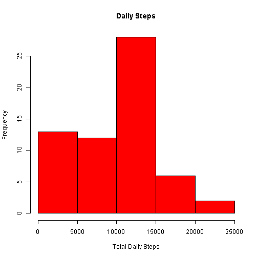
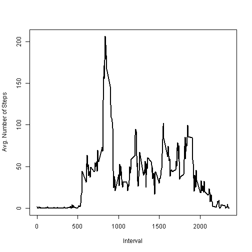
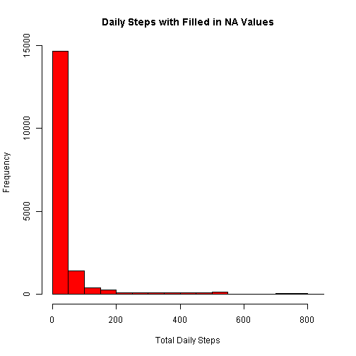
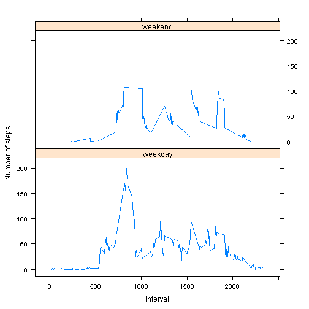

## Loading and preprocessing the data
- Load the data into a data frame, assuming the current working directory contains the source file zipped as activity.zip


```r
activity <- read.csv(unz("activity.zip","activity.csv"))
```


## What is mean total number of steps taken per day?
- Calculate the total number of steps taken per day


```r
dailysums <- aggregate(activity$steps, by=list(date=activity$date), FUN=sum,na.rm=TRUE)
colnames(dailysums)[2] <- "steps" ##RENAMING CALC COLUMN
```

- Make a histogram of the total number of steps taken each day


```r
hist(dailysums$steps,freq=TRUE,xlab="Total Daily Steps", col="red",main="Daily Steps")
```

 

- Calculate and report the mean and median of the total number of steps taken per day


```r
mean(dailysums$steps)
```

```
## [1] 9354.23
```

```r
median(dailysums$steps)
```

```
## [1] 10395
```


## What is the average daily activity pattern?
- Make a time series plot (i.e. type = "l") of the 5-minute interval (x-axis) and the average number of steps taken, averaged across all days (y-axis)


```r
intmeans <- aggregate(activity$steps, by=list(interval=activity$interval), FUN=mean,na.rm=TRUE)
colnames(intmeans)[2] <- "steps" ##RENAMING CALC COLUMN
plot(intmeans$interval, intmeans$steps, type="l", xlab= "Interval", ylab= "Avg. Number of Steps", lwd=2)
```

 

- Which 5-minute interval, on average across all the days in the dataset, contains the maximum number of steps?


```r
intmeans[(which.max(intmeans$steps)),1]
```

```
## [1] 835
```


## Imputing missing values
- Calculate and report the total number of missing values in the dataset (i.e. the total number of rows with NAs)


```r
sum(!is.na(activity$steps)) 
```

```
## [1] 15264
```

- Devise a strategy for filling in all of the missing values in the dataset. The strategy does not need to be sophisticated. For example, you could use the mean/median for that day, or the mean for that 5-minute interval, etc.
	* For each NA, we will insert the mean for that 5 min interval from the entire dataset.

- Create a new dataset that is equal to the original dataset but with the missing data filled in.

```r
nona <- merge(activity,intmeans,by="interval") #MERGE ORIGINAL DATA WITH INTERVAL MEANS
colnames(nona)[2] <- "steps" #RENAMING MERGE COLUMNS
colnames(nona)[4] <- "intsteps" #RENAMING MERGE COLUMNS
nona <- within(nona, steps <- ifelse(is.na(steps), intsteps, steps)) ##UPDATE STEPS COLUMN WITH MEANS WHEN NA
```

- Make a histogram of the total number of steps taken each day and Calculate and report the mean and median total number of steps taken per day. Do these values differ from the estimates from the first part of the assignment? What is the impact of inputing missing data on the estimates of the total daily number of steps?

```r
hist(nona$steps,freq=TRUE,xlab="Total Daily Steps", col="red",main="Daily Steps with Filled in NA Values") ##NA HISTOGRAM
```

 

```r
mean(nona$steps) #Calculate and report the mean total number of steps taken per day. 
```

```
## [1] 37.3826
```

```r
median(nona$steps) #Calculate and report the median total number of steps taken per day.
```

```
## [1] 0
```

- Substituting the 5 minute interval mean as a replacement value for NA's in the original dataset had an enourmous impact. It introduced many more lower values, reducing the mean and median values as well as skewing the histogram distribution significantly.   


## Are there differences in activity patterns between weekdays and weekends?
- Create a new factor variable in the dataset with two levels - "weekday" and "weekend" indicating whether a given date is a weekday or weekend day.

```r
actdays <- nona
actdays <- within(actdays, daytype <- ifelse((weekdays(as.Date(activity$date,'%Y-%m-%d')) %in% c("Sunday","Saturday")), "weekend", "weekday"))
```

- Make a panel plot containing a time series plot (i.e. type = "l") of the 5-minute interval (x-axis) and the average number of steps taken, averaged across all weekday days or weekend days (y-axis). See the README file in the GitHub repository to see an example of what this plot should look like using simulated data.


```r
library("lattice")
actdaysint <- aggregate(actdays$steps, by=list(actdays$daytype,actdays$interval), FUN=mean)
colnames(actdaysint)[1] <- "day" ##RENAMING CALC COLUMN
colnames(actdaysint)[2] <- "interval" ##RENAMING CALC COLUMN
colnames(actdaysint)[3] <- "steps" ##RENAMING CALC COLUMN
xyplot (actdaysint$steps ~ actdaysint$interval|actdaysint$day, type="l", xlab="Interval", ylab="Number of steps",layout = c(1,2))
```

 
